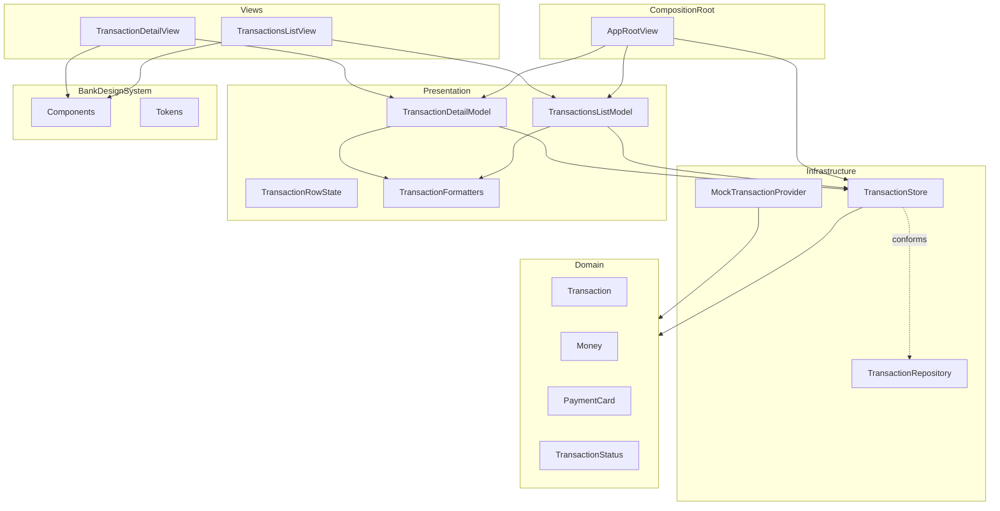
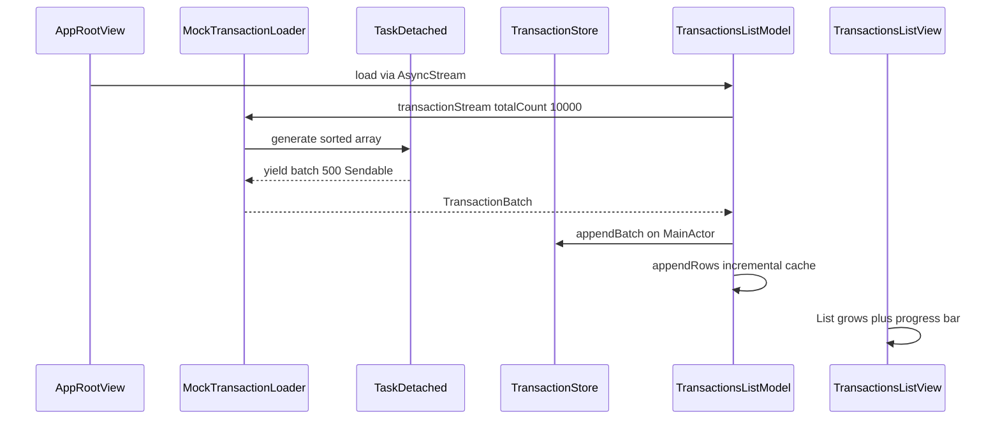

# Architecture

## Purpose

Describe the **as-built** architecture of the Banking App: layers, data flow, state ownership, navigation, and edit behavior.

## Audience

Staff iOS engineers, reviewers, and contributors.

## Table of Contents

- [Overview](#overview)
- [Layer Diagram](#layer-diagram)
- [Layer Responsibilities](#layer-responsibilities)
- [State and Observation](#state-and-observation)
- [Data Flow](#data-flow)
- [Edit Flow](#edit-flow)
- [Navigation](#navigation)
- [Dependency Injection](#dependency-injection)
- [Design System Boundary](#design-system-boundary)
- [Project Structure](#project-structure)
- [Known Limitations](#known-limitations)
- [Cross References](#cross-references)

---

## Overview

SwiftUI banking app targeting **iOS 26** with the **Observation** framework. Two screens: **Transactions List** and **Transaction Detail**. State flows from an in-memory store through presentation models into declarative views. UI primitives live in the local **`BankDesignSystem`** Swift Package.

**Assignment core behavior:** Edit transaction fields on detail; navigate back; list reflects changes immediately (no save button).

---

## Layer Diagram



> **Note:** Presentation models currently depend on concrete `TransactionStore`, not the `TransactionRepository` protocol type. See [ENGINEERING_DECISIONS.md](ENGINEERING_DECISIONS.md) D13.

---

## Layer Responsibilities

| Layer | Key files | Responsibility |
|-------|-----------|----------------|
| **Composition root** | `BankApp/App/AppRootView.swift` | Owns store and list model; constructs detail model per navigation push; applies keyboard toolbar |
| **Views** | `Features/TransactionsList/`, `Features/TransactionDetail/` | Layout, navigation chrome, `@Bindable` model consumption, thin lifecycle triggers |
| **Presentation models** | `*Model.swift` | Search debounce, filtering, row snapshots, draft state, `commit()`, formatting orchestration |
| **Repository** | `TransactionRepository.swift`, `TransactionStore.swift` | In-memory persistence, query, mutation; `@Observable` for UI refresh |
| **Domain** | `Models/` | Pure value types — no screen formatting |
| **Formatters** | `Features/Shared/TransactionFormatters.swift` | List/detail display strings and parse helpers |
| **Design System** | `Packages/BankDesignSystem/` | Tokens and dumb UI components |

### View rules

Views **may:** compose UI, bind to model, trigger commands (`.task`, `onDisappear`).

Views **must not:** access store/repository, parse domain values, construct business bindings, mutate persistence.

Enforced in `.cursor/rules/swiftui_view_*.mdc`.

---

## State and Observation

| Type | Role |
|------|------|
| `TransactionStore` | Source of truth for `[Transaction]`; `@MainActor` `@Observable`; O(1) lookup via `indexByID` |
| `TransactionsListModel` | AsyncStream consumption, incremental row cache, debounced search |
| `TransactionDetailModel` | Draft strings, hero computed values, `commit()` |
| Views | `@Bindable var model` only |

**Why observable store:** After detail `commit()`, list patches the changed row via `dataRevision` / `lastUpdatedTransactionID` without rebuilding all 10K rows. See [ENGINEERING_DECISIONS.md](ENGINEERING_DECISIONS.md) D5 and D30.

---

## Scale and Async Loading

The app targets **10,000 in-memory transactions** loaded progressively at launch.



| Concern | Approach | Trade-off |
|---------|----------|-----------|
| Launch blocking | Background generation; stream slices of 500 | Full sort happens once off main thread before streaming |
| List rendering | SwiftUI `List` virtualization | Only visible cells rendered |
| Row formatting | Incremental `TransactionRowState` cache | Avoids O(n) map on every Observation tick |
| Edit refresh | Single-row patch via `lastUpdatedTransactionID` | Search filter may still re-filter on mismatch |
| Search | Debounced O(n) filter on loaded set | Acceptable at demo scale; no FTS index |
| Lookup | `indexByID` dictionary | O(1) detail init and commit |

**Concurrency boundaries:** `Transaction` payloads are `Sendable`; batches produced in `Task.detached`; all store mutations on `@MainActor`. See D30.

Previews use a **50-item sync subset** via `PreviewTransactionStore` — no stream in `#Preview`.

---

## Data Flow

```
MockTransactionLoader.transactionStream (background)
                              ↓ batches of 500
              TransactionsListModel.load → store.appendBatch
                              ↓
              Incremental row cache → TransactionsListView
                              ↓ NavigationLink(Transaction.ID)
              TransactionDetailModel.init ← O(1) store lookup
                              ↓
                    TransactionDetailView ← $model.draft*
                              ↓ onDisappear
                         model.commit()
                              ↓
              store.updateTransaction → dataRevision bump
                              ↓
              List model patches single row in cache
```

---

## Edit Flow

```mermaid
sequenceDiagram
    participant Root as AppRootView
    participant View as TransactionDetailView
    participant Model as TransactionDetailModel
    participant Store as TransactionStore
    participant List as TransactionsListModel

    Root->>Model: init(store, transactionID)
    Model->>Store: transaction(id:)
    Model->>Model: load draft from domain
    View->>Model: bind draft fields
    Note over View,Model: User edits draft only — store unchanged
    View->>Model: onDisappear → commit()
    Model->>Model: skip if unchanged; parse draft
    Model->>Store: updateTransaction(...)
    Store-->>List: dataRevision bump
    List->>List: patchRow for updated ID
```

### Draft fields (nine)

| Draft property | Domain field |
|----------------|--------------|
| `draftWithdrawalLabel` | `withdrawalAccount.label` |
| `draftWithdrawalLast4` | `withdrawalAccount.last4` |
| `draftRecipientName` | `recipientName` |
| `draftRecipientPhone` | `recipientPhone` |
| `draftBeneficiaryCard` | formatted `beneficiaryCardLast4` |
| `draftAmount` | `amount` |
| `draftCommission` | `commission` |
| `draftOperationNumber` | `operationNumber` |
| `draftDate` | `date` |

Parse failures on commit silently retain previous domain values for that field. See [ENGINEERING_DECISIONS.md](ENGINEERING_DECISIONS.md) D18.

---

## Navigation

- Single `NavigationStack` in `AppRootView`
- Push: `NavigationLink(value: row.id)` where `id` is `Transaction.ID` (`UUID`)
- Destination: `.navigationDestination(for: Transaction.ID.self)` constructs `TransactionDetailModel`
- List hides system navigation bar; custom header

---

## Dependency Injection

**Pattern:** Manual constructor injection at composition root.

```swift
// AppRootView — allowed
.navigationDestination(for: Transaction.ID.self) { id in
    TransactionDetailView(
        model: TransactionDetailModel(repository: store, transactionID: id)
    )
}

// Feature view — required shape
struct TransactionDetailView: View {
    @Bindable var model: TransactionDetailModel
    // layout only
}
```

No `@Environment(TransactionStore.self)` in feature views.

---

## Design System Boundary

`BankDesignSystem` is a local SPM with tokens and components. Components accept `String`, `Binding<String>`, and booleans — never `Transaction` or store types.

Details: [DESIGN_SYSTEM.md](DESIGN_SYSTEM.md)

---

## Project Structure

```
BankApp/
├── App/                 AppRootView (composition root)
├── Features/
│   ├── Shared/          TransactionFormatters
│   ├── TransactionsList/
│   └── TransactionDetail/
├── Models/
├── Services/            Loader, Repository, Store, Mock provider
└── Preview Support/

Packages/BankDesignSystem/
├── Tokens/
├── Components/
└── Extensions/
```

---

## Known Limitations

- In-memory only — no persistence across launches
- No automated test target
- Protocol DI incomplete (models use concrete store)
- iOS 26 deployment target only
- Search is O(n) over in-memory loaded set — no full-text index
- Full 10K array generated once in background before batch streaming begins
- Silent parse failures on commit (no validation UI)

Future work: [ROADMAP.md](ROADMAP.md)

---

## Cross References

- [ENGINEERING_DECISIONS.md](ENGINEERING_DECISIONS.md) — decision log with confidence labels
- [DESIGN_SYSTEM.md](DESIGN_SYSTEM.md) — tokens and components
- [README.md](../README.md) — run and verify instructions
- `.cursor/rules/swiftui_view_dependencies.mdc` — DI enforcement
